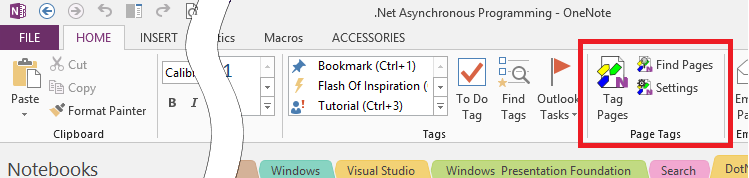

# _OneNote Tagging Kit_ Installation and Upgrade{.title}

1. Verify that you have a supported version of OneNote.
   See [OneNote Version Check](OneNote-Version-Check.md) on how to do that.
2. Make sure _OneNote_is **not running**! Exit _OneNote_ if necessary.
3. Run the installer downloaded from the
   [Releases](https://github.com/WetHat/OnenoteTaggingKit/releases) page.

   Alternatively you can also install or upgrade the _OneNote Tagging Kit_ via the [Chocolatey](https://community.chocolatey.org/packages/onenote-taggingkit-addin.install)
   package manager for Windows. On a _PowerShell_ command prompt type:

> **Install:**
> ~~~ powershell
> C:\> choco install onenote-taggingkit-addin.install
> ~~~
>
> **Upgrade:**
>
> ~~~ powershell
> C:\> choco upgrade onenote-taggingkit-addin.install
> ~~~

4. Accept the license agreement (if not installing via Chocolatey).
5. Start OneNote
   The _OneNote Tagging Kit_ actions should now be available on the `Home` tab in
   the _Page Tags_ command group (next to the built-in Tags command group):

   

See the [Troubleshooting Tips](Troubleshooting-Tips.md) if anything went wrong.