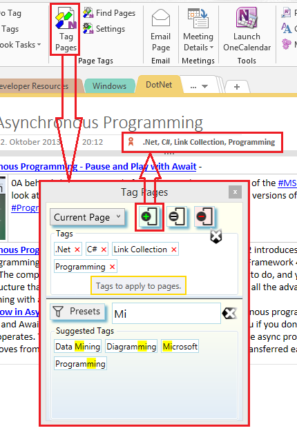

# _OneNote Tagging Kit_ Add-In{.title}

A free to-use, add-in to add page tagging and advanced search to _OneNote_
for the desktop. The add-in is hosted on
[GitHub](https://github.com/WetHat/OnenoteTaggingKit) as _Open Source_ project.

{.rightfloat height="30%"}

# Feature Overview

* Unlike the build-in OneNote paragraph tags, _Tagging Kit Page Tags_ mark an
  entire page. The _OneNote Tagging Kit_ utilizes _Page Tags_ to provide
  an enhanced search experience which allows to search for pages by
  [Faceted Search](https://en.wikipedia.org/wiki/Faceted_search)
  combined with full-text queries.
  Search results can be dynamically refined by adding additional
  _Page Tag_ or full text conditions to the filter.
* The add-in provides several integrated dialogs to apply, manage, and search
  with page tags.
* Tagging operations are performed in the background. _OneNote_ can be used
  normally while tagging is in progress.
* Page Tags are based on _OneNote_ paragraph tags and are automatically shared
  to all connected OneNote clients. If a _OneNote_ client does not have the
  _Tagging Kit_ installed, it still has access to the page tags via
  the built-in _OneNote_ tagging system. If a connected _OneNote_ client has the
  _Tagging Kit_ add-in, full tagging functionality is available.

Version specific features are covered in the [release specific](#releases)
documentation of the add-in.

# About Tagging

[The Use of Tags](Use%20of%20Tags.md) briefly outlines the concept behind tags
for information management.

Some thoughts about the use of _Page Tags_ to organize notes in _OneNote_ can
be found in [Organizing Notes with Page Tags](Organizing%20Notes%20with%20Page%20Tags.md).

# Getting Started

Before installing make sure to read to the release specific
[installation instructions](#releases) of the version you are planning to install.
This will help you to understand the system requrements and pick the best installation
option for the the _Tagging Kit_.

The _Tagging Kit_ dialogs show _tooltips_ for most user interface elements on hovering the
mouse over them. So, you can _fly by the seat of your pants_ and explore the usage of the
tagging kit as you go. Nevertheless, it might also be useful to take a look at the
documentation ;-).

# Releases

🌟 **v4.0** - [Documentation](v4.0/Home.md) -
[Installation](v4.0/Home.md#installation-and-upgrade) -
[Release Notes](https://github.com/WetHat/OnenoteTaggingKit/releases)

