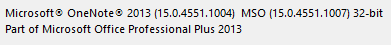
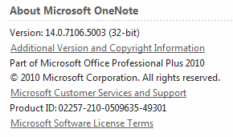

# Checking the _OneNote_Version 

To check which version of _OneNote_you have (32-bit or 64-bit) perform these steps:

## For _OneNote_2013,2016 and later (including all _OneNote_desktop versions from Office 365)

Click on: `File -> Account -> About OneNote` .
This opens a dialog with detailed version information at the top. You should see something like:

> 

## For _OneNote_2010

Click on: `File -> Help`

You find the detailed version information in the right hand side of the page.
You should see something like:

> 
