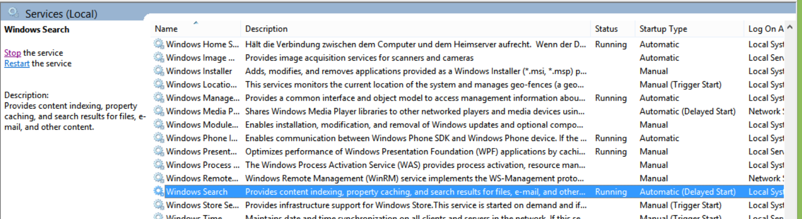

# Exception from HRESULT: 0x80042019{.title}

An error message containing the error code **0x80042019** indicates
an issue with searching _OneNote_pages for tags or text.
The _OneNote Tagging Kit_ uses the _Windows Search_ service to quickly
find _OneNote_pages. If regular search in _OneNote_(not in the Tagging Kit)
does not work either, error  **0x80042019** most likely has one of the following
causes:
 
* **The _Windows Search_ service is not running**: To make sure that this service is configured properly and available, perform following steps:
  * Press _Windows Key_ + R, type _services.msc_, and click OK.
  * In the services window which just opened, scroll down to  _Windows Search_ and check that the service is running and configured for automatic start as shown in the screen shot below
    
    
  
  * If the _Windows Search_ service is not running, or not configured for automatic start, right mouse click the service and select the _Properties action_. Make sure the service is configured as shown in the screenshot below and finally start the service by pressing the _Start_ button:
    
    

* **The _OneNote_search index is corrupted**: To repair the index please, try
  the fixes discussed in [OneNote search broken](http://answers.microsoft.com/en-us/office/forum/office_2007-onenote/onenote-search-broken/9e4ab850-681f-45a1-8312-80a25de8a19f)