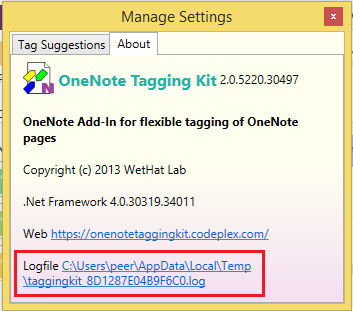

# Troubleshooting Tips {.title}

If the issue you are having is not already covered below, please also check the
[Issues](https://github.com/WetHat/OnenoteTaggingKit/issues) page on GitHub.
Your issue may already heve been reported or fixed.

# Known Issues{.unfloat}

* [The Tagging Kit command group does not show up in the _OneNote_ribbon bar](Tagging%20Kit%20Not%20Shown%20in%20Ribbon.md)
* [Searching pages by Tags or Full-Text Queries does not work](Searching-pages-by-Tags-or-Full-Text-Queries-does-not-work.md)
* [Exception from HRESULT: 0x8004200C](0x8004200C.md)
* [Exception from HRESULT: 0x80042019](0x80042019.md)
* [Exception from HRESULT: 0x80042030](0x80042030.md)

{.rightfloat}
    
# Submitting a New Issue or Enhancement Request

You are very nuch welcome to report issues or submit enhancement requests.
Before doing so, please check that nothing
appropriate is recorded at
[Issues](https://github.com/WetHat/OnenoteTaggingKit/issues)

If you are reporting a bug, make sure you **always** attach the add-in's logfile.
The easiest way to locate the logfile is to open  the `Settings` dialog and
select the `About` tab.

Alternatively you can open File Explorer, navigate to the
`%TEMP%` directory and pick up the **newest** logfile named `taggingkit_*.log`.
The `*` stands for a sequence of characters and numbers, e.g.
`taggingkit_8DA0C2A5B55670C.log`.

