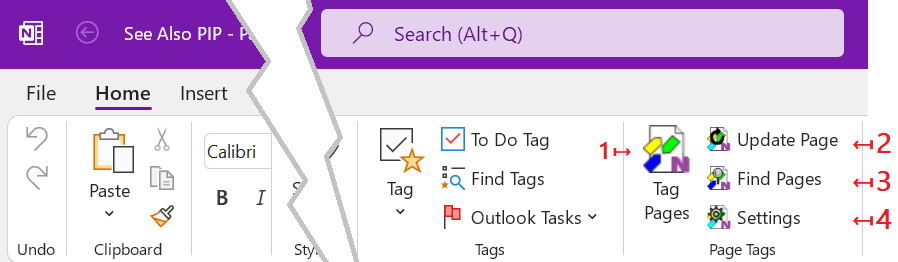

# The OneNote Ribbon Bar{.title}
    
All commands and dialogs of the _OneNote Tagging Kit_ are available in the
`Home` tab of OneNote ribbon bar.

1. The [Tag Pages](Tagging%20Pages/Tagging%20Pages.md) dialog. Manage _Page Tags_ on
   _OneNote_ pages (add / remove).
2. The [Update Pages](Update.md) command. Update imported tags and [Saved Searches](Search/Advanced/Saved%20Search.md) on the current page.
3. The [Find Pages](Search/Finding%20Notes.md) dialog. Find Notes by tag and full-text filters. 
4. The [Settings](Settings/Manage%20Settings.md) dialog. Manage add-in settings. 
