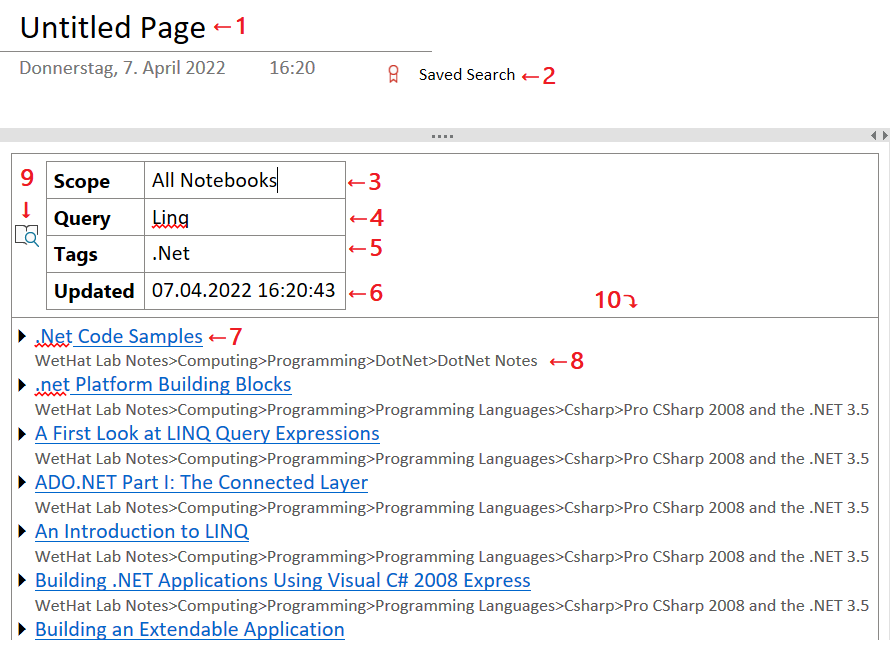

# Saving Search Results to a _OneNote_ Page{.title}

Search results obtained by the [_Find Pages_](Finding%20Notes.md) dialog can be saved
as _active_ content to a new _OneNote_ page in the current section using the
`Save Search Result` action from the [drop-down menu](Finding%20Notes.md#Dia-15)
of the [_Pages_](Finding%20Notes.md#Dia-14) search result panel.

{.rightfloat}

# The layout of a _Saves Search_

:point_up: Numbered cells of the sample _Saved Search_ are referenced by superscripts and list item
indices.

1. The default title of a _Saved Search_. Can be customized by the user.
2. By default pages containing _Saved Searches_ are marked with the _Saved Search_
   tag. This makes it easy to locate pages containing _Saves Searches_ so that they
   can be updated. This tag can be removed with the
   [Tag Pages](../Tagging%20Pages/Tagging%20Pages.md) dialog.
3. The [search scope](Finding%20Notes.md#Dia-1) that was in effect
   when the search result saved by the `Save Search Result` action in the
   [_Find pages_](Finding%20Notes.md) dialog.

   :warning: This cell is meant to be **read-only**. Any edits may cause unpredictable side effects!
4. The [full-text query](Finding%20Notes.md#Dia-2) that was in effect when the search
   result was saved by the `Save Search Result` action in the
   [_Find pages_](Finding%20Notes.md) dialog.

   :point_up: This cell can be edited. The changed full text search terms will take effect
   on next page update by the [_Update_](../Update.md) command or the
   [_Update_](../Tagging%20Pages/Tagging%20Pages.md#Dia-5) action of the
   [_Tag Pages_](../Tagging%20Pages/Tagging%20Pages.md) dialog.
5. The comma-separated list of [refinement tags](Finding%20Notes.md#Dia-5) that was in effect when the search
   result was saved by the `Save Search Result` action in the
   [_Find pages_](Finding%20Notes.md#Dia-2) dialog.

   :point_up: This cell can be edited. Changes in the tag list will take effect
   on next page update by the [_Update_](../Update.md) command or the
   [_Update_](../Tagging%20Pages/Tagging%20Pages.md#Dia-5) action of the
   [_Tag Pages_](../Tagging%20Pages/Tagging%20Pages.md) dialog.

   :point_up: The tag names in this cell are matched in a lenient way by
   ignoring hash characters, casing, or spacing. E.g
   the tags `#softwaredevelopment`, `#SoftwareDevelopment`, `SoftwareDevelopment`,
   `Software Development` are all treated as equivalent.

6. The timestamp when the _Saved Search_ waas created or last updated
   by the [_Update_](../Update.md) command or the
   [_Update_](../Tagging%20Pages/Tagging%20Pages.md#Dia-5) action of the
   [_Tag Pages_](../Tagging%20Pages/Tagging%20Pages.md) dialog.
7. A page link in the search result
8. The path in the _OneNote_ page hierarchy leadinf to this page.
9. A _OneNote_ tag marking the search configuration that was captured
   when the search result was saved by the`Save Search Result` action
   of  the [_Pages_](Finding%20Notes.md#Dia-14) search result panel.

   :warning: If this onenote tag is removed or changed the saved search
   can no longer be updated.

10. List of pages constituting the search result.

    :warning: This cell is is meant to be **read-only**. Any changes will
    be lost when on next update.

