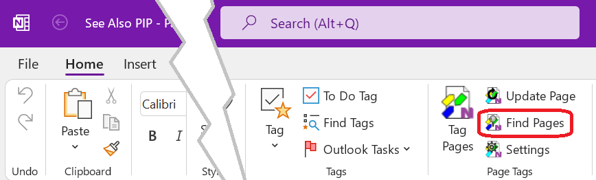

# Finding _OneNote_ Pages

The _Find Pages_ dialog is used to find _OneNote_ pages by applying tag and
full text filters.

To acivate the _Fins Pages_ dialog click or tap on the _Fins Pages_
button of the _Page Tags_ group in the `Home` tab of the _OneNote_ ribbon.

# The _Find Pages_ Dialog

:point_up: Numbered dialog elements are referenced by superscripts and list item
indices.

{.rightfloat}

1. The search scope. Only pages in the selected scope will be included in the
   search result. Available scopes are:{id="Dia-1"}

   `This Section`
   :   Only pages from the current section are included in the search result.

   `This Section Group`
   :    Only pages from the current section group are included in the
        search result.

   `This Notebook`
   :   Only pages from the current notebook are included in the
        search result.

   `All Notebooks`
   :   Pages from all notebooks currently open in OneNote are included in the
       search result.
2. Search query input box for full text search quavailable while focus is on the
   query input box:{id="Dia-2"}

    `ESC`
    :   Clear the query input box. To update the query tap or click the search
        button[^3^](#Dia-3).

    `ENTER`
    :   Perform a full text search using the entered search terms.
       Same as clicking on the _search_ button[^3^](#Dia-3)
3. Perform a full text search using the terms in the query input
   box[^2^](#Dia-2). The search result is displayed in the _Pages_
   panel[^14^](#Dia-14). Matches of search terms with page titles are highlighted
   [^16^](#Dia-16). Only pages in the selected scope[^1^](#Dia-1) are
   shown.{id="Dia-3"}
4. A tag selected for refinement. To remove the tag from the filter, click or
   tap on it.{id="Dia-4"}
5. The  _Refinement Tags Panel_. The number in parentheses after the panel title
   indicates the number of tags selected for refinement.{id="Dia-5"}
6. Clears all currently selected refinement tags.{id="Dia-6"}
7. Tag Filter Presets. Filters the collection of tags currently available in the
   _Page Tags_ panel[^14^](#Dia-14) using tags found in the selected range.
   The tag presets are entered into the
   tag input box[^8^](#Dia-8) as comma separated list and can be used to update
   the page search result by clicking the _Select all matching tags_ button
   [^11^](#Dia-11) to refine the search result[^14^](#Dia-14).{id="Dia-6"}
8. Tag filter input box. Enter one or more tagnames (comma ',' separated) to
   to show only tags in the _Tags_ panel[^14^](#Dia-14) which match any of the
   typed tag names.
   The collection of tags in the _Page Tags_ panel[^14^](#Dia-14) is updated
   as you type.{id="Dia-8"}

   Following keyboard shortcuts are supported while focus is on the
   input box:

   `ESC`
   :   Clear the input box. Same as pressing the _Clear_ button[^9^](#Dia-9).

   `SHIFT`+`ESC`
   :   Clear the tag input box and also clear all currently selected refinement
       tags[^5^](#Dia-5) (Same as pressing the _Clear_ button[^9^](#Dia-9)) **and**
       also the _Clear_ button[^6^](#Dia-6).

   `ENTER`
   :   Select all tags from the collection of tags in the _Page Tags_ panel[^10^](#Dia-10)
       which fully match one of the entered tag names to happen to fully match a tag.
       The collection of refinement tags in the _Refinement Tags_ panel[^5^](#Dia-5)
       and the list of found pages[^14^](#Dia-14) are updated accordingly.
9. Clear the current tag filter entered in the tag filter input box[^8^](#Dia-8).{id="Dia-9"}
10. _Page Tags_ panel. The collection of tags available for refinement. If this
    collection is inconveniently large large, enter a tag filter into the tag filter input box
    [^8^](#Dia-8) to show only matching tags.{id="Dia-10"}
11. Select fully matching tags. Selects all tags from the _Page Tags_[^10^](#Dia-10)
    panel which fully match one of the tags entered in the tag filter input
    box[^8^](#Dia-8).{id="Dia-11"}
12. A tag available for search result refinement. This tag is an imported hashtag
    and matches the partial tag name entered in the tag filter input box[^8^](#Dia-8).
    A tap or click on it selects it for refinement[^5^](#Dia-5) and updates the search result
    [^14^](#Dia-14).{id="Dia-12"}
13. A genuine _Page Tag_ (not imported) available for search result refinement.
    The tag matches the partial tag name entered in the tag filter input box[^8^](#Dia-8).
    A tap or click on it selects it for refinement[^5^](#Dia-5) and updates the search result
    [^14^](#Dia-14).{id="Dia-13"}
14. The _Pages_ search result panel. Displays all pages matching the refinement
    tag filter[^5^](#Dia-5) and the full text query specified in[^2^](#Dia-2).
    The Panel header shows additional status information:{id="Dia-14"}

    * The number in parenthesis after the panel title indicates the number of
      pages matching the search criteria.
    * 🔖 - The number of tags in the refinement filter[^5^](#Dia-5).
    * 🔍 - The full text search query[^2^](#Dia-2) used.
15. The _Search Result Action Menu_. Click or tap to access actions for the
    search result[^14^](#Dia-14).{id="Dia-15"}

    The available actions are.

    `Refresh`
    :   Refresh the search result using the current collection if refinement
        tags[^5^](#Dia-5) and the current search query. This is sometimes
        needed when pages have been tagged while _Find Pages_ dialog was open.

    `Clear Selection`
    :   Deselect all page links[^16^](#Dia-16) in the _Pages_ search result
        panel[^14^](#Dia-14).

    `Select All`
    :   Select all page links in the in the _Pages_ search result
        panel[^14^](#Dia-14).

    `Copy Links to Pages`
    :   Copy hyperlinks to all selected pages in the _Pages_ search result
        panel[^14^](#Dia-14) to the system clipboard. These links can be pasted
        into all HTML capable applications such as _Microsoft Office_.
        
        :point_up: Links to pages in the _OneNote_ recycle bin will be
        automatically removed.

    `Save Search Result`
    :   Saves all links from the _Pages_ search result panel[^14^](#Dia-14)
        together with the search parameters
        (query[^2^](#Dia-2) and refinement tags[^5^](#Dia-5)) to a new
        _OneNote_ page in the current section. See [Saved Search](Advanced/Saved%20Search.md)
        for instruction on how to update the search result with the
        [Update](../Update.md) action on the _OneNote_ `Home` ribbon or the
        _Update_action on
        [Tag Pages](../Tagging%20Pages/Tagging%20Pages.md#Dia-5) dialog.

     `Tag Selected Pages`
     :   Opens the [Tag Pages](../Tagging%20Pages/Tagging%20Pages.md) dialog
         to apply tags to all pages selected in the _Pages_ search result
         panel[^14^](#Dia-14).

     `Mark Selected Pages`
     :   Adds a :star: marker tag to all selected pages. This marker tag can
        be managed like a regular _Page Tag_ and also can participate
        in tag based searches.
16. A link to a page in the search result. Tap or click on the link to navigate
    to the page in _OneNote_. A link can be selected by clicking on the `❱` symbol.
    Several page links can be selected by holding the `CTRL`-key while clicking.
    Holding the `SHIFT`-key while clicking allows selection of ranges of links.
    Link  selections are required for some actions in the _Search Result Action Menu_
    [^15^](#Dia-15).{id="Dia-16"}
17. Activate Tracking Mode. Automatically tracks related pages based on the tags
    of the current page. When tag tracking is enabled:{id="Dia-17"}

    * the current page's title is displayed next to the tag tracking checkbox.
    * the tags on the current _OneNote_ page are extracted and pre-set as
      filter for the _Page Tags_ panel[^10^](#Dia-10)  Only tags which fully or
      partially match one of the tags in the tag input panel [^8^][#Dia-8] will
      now be shown.
    * The _Select fully matching tags_[^11^](#Dia-11) action  to
      quickly get all pages with these tags.

# Workflows

In the following section the workflows of typical search related tasks are
explained step-by-step.

## Finding Pages by applying Filter Conditions
> The steps below are all optional and can be performed in any order:
> * Select a range where to define pages in[^1^](#Dia-1).
> * Type one or more search terms into the search input box[^2^](#Dia-2)
>   and either press `ENTER`, or press the search button[^3^](#Dia-3).
> * Add tags from the _Page Tags_ panel[^10^](#Dia-10) to the filter
>   condition. This can be done in the following ways:
>   * by tapping or clicking on the tags in the _Page Tags_ panel[^10^](#Dia-10).
>   * by entering one or more full or partial tag names (comma-separated)
>     into the tag input panel[^8^](#Dia-8). To select the desired tags
>     press `ENTER` or hitting the _Add_ button[^11^](#Dia-11).
>     This adds all tags from the _Page Tags_
>     panel[^10^](#Dia-10) which fully match one of
>     the entered tag names to the filter[^5^](#Dia-5).
>     Alternatively you can tap or click on individual tags in the
>     _Page Tags_ panel[^10^](#Dia-10).
>   * by selecting a preset[^7^](#Dia-7) to enter the tags from a
>     range of pages into the tag input box and then hitting the
>     _Add_ button[^11^](#Dia-11) to add all tags from the _Page Tags_
>     panel[^10^](#Dia-10) which fully match one of
>     the entered tag names to the filter[^5^](#Dia-5).
>
> :point-up: After any of the steps above the search result[^14^](#Dia-14) is updated. 

## Handling large Numbers of Tags
>
> Eventually, as the used tags increases the _Page Tags_ panel[^10^](#Dia-10)
> will become quite crowded. This makes tag selection to add them to the
> filter condition increasingly difficult because there will be a lot of
> scrolling to get to the desired tags. To reduce the number of tags shown in
> the Page Tags_ panel[^10^](#Dia-10) type a comma-separated list of tag names
> into the tag input box[^8^](#Dia-8).
> This will the show only tags which match one of the typed tags.
> Instead of typing tags you may want us a preset[^^](#Dia-7) to enter tags
> from a range of pages into the tag input box[^8^](#Dia-8)
>
> At any time, you can start filtering by adding or removing tags to the filter
> condition.  

## Refining a full-text Search Query using tags
>
> We start with a full-text search query which we refine by a adding tag filters.
>
> 1. Pick a scope [^1^](#Dia-1) to define the range of pages to search in.
> 2. Enter one or more search terms[^2^](#Dia-2).
> 3. Tap or click the search button [^3^](#Dia-3) or press `Enter` while focus is still
>    in the search input box[^2^](#Dia-2).to perform the search.
>    When the search is completed, a list of pages matching the search term(s)
>    is displayed in the _Pages_ search result panel[^14^](#Dia-14).
>    Matches of search terms in page titles are highlighted[^16^](#Dia-16).
> 4. To narrow down (refine) the search result, select one ore more tags for
>    filtering. This can be done in several ways:
>    * Tap or click on the tags in the in the _Refinement Tags_ panel[^5^](#Dia-5).
>    * Type a comma-separated list of full or partial tag names into the tag
>      input box.
>  After that only pages which have
>    **all** selected tags and also match the full-text search query are
>    shown in the _Pages_ search result panel[^14^](#Dia-14).
> 5. Click the hyperlinks in the _Found Pages_ panel **(5)** to navigate to the corresponding _OneNote_pages.
>   for more ways to work with the search result see [[Working with the Search Result]]
