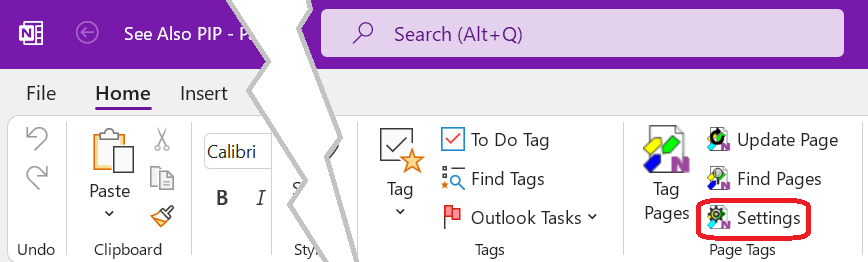

# Managing Settings{.title}

The _Settings_ dialog provides various customization options for the _Tagging Kit_.

To acivate the _Manage Settings_ dialog click or tap on the _Settings_
button of the _Page Tags_ group in the `Home` tab of the _OneNote_ ribbon.

The dialog has following tabs to choose from:
* [Preferences Tab](Preferences-Tab.md) - Change add-in preferences. 
* [Suggested Tags Tab](Suggested%20Tags%20Tab.md) - Manage tag suggestions for 
  the [Tag Pages](../Tagging%20Pages/Tagging%20Pages.md) dialog.
* [About Tab](About%20Tab.md) - Display version and support information.