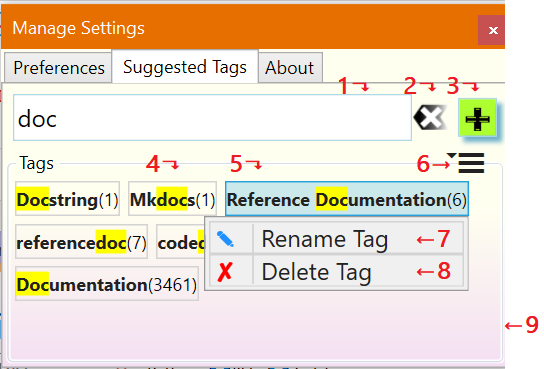

# The _Suggested Tags_ Tab{.title}

The _Suggested Tags_ tab manages the collection of tags which the
[Tag Pages](../Tagging%20Pages/Tagging%20Pages.md) dialog uses as
suggestions.

:point_up: Numbered dialog elements are referenced by superscripts and list item
indices.

{.rightfloat}

1. Tag input box for entering one or more tags (comma ',' separated).
    Tags in the _Suggested Tags_ panel[^13^](#Dia-13) are filtered and highlighted as you
    type. Following keyboard shortcuts are supported while focus is on the
    input box:{id="Tab-1"}
    
    `ESC`
    :   Clear the input box. Same as pressing the _Clear_ button[^2^](#Tab-2).
    
    `ENTER`
    :   Add the typed list of tag names to the collection of tags in
        the_Tags_ panel[^9^](#Tab-9).
        subsequent tagging operations. The names of new tags are updated
        according to the _Tag Format_ selected on the
        [Preferences](Preferences-Tab.md) tab.
2. Clear the tag input box.{id="Tab-2"}
3. Add the comma separated list of tags typed into [^1^](#Tab-1) to the
   collection of suggested tags[^9^](Tab-9). The names of new tags are
   updated  according to the _Tag Format_ selected on the
   [Preferences](Preferences-Tab.md) tab.{id="Tab-3"}
4. A suggested tag. The number in parentheses indicates the number of times this
   tag is use on _OneNote_ pages.{id="Tab-4"}
5. A suggested tag with its action menu open. The action menus isopened by clicking
   on the tab.{id="Tab-5"}
6. Action menu. Opens when clicked or tapped.{id="Tab-6"}
   
   `Refresh`
   :   Update the collection of suggested tags.
   
   `Copy Tags`
   :   Copies a list of suggested tags to the clipboard. This allows tags to be
       shared to other _OneNote_  users. For more details see
       [Sharing Tag Suggestions](Sharing%20Tag%20Suggestions.md)

   `Sort By Name` 
   :   Sort the tag collection alphabeticalls (default):
   
   `Sort By Usage`
   :   Sort the tag collection by usage in ascending order. Useful to detect
       and clean up unsised tags (use count 0).      
7. `Rename Tag` action for a selectedsuggested tag[^5^](#Tab-5).
   Once the rename is confirmed,
   all pages using that tag are updated to reflet the new name. The update is a
   background operation.{id="Tab-7"}
8. `Delete Tag` action for a selectedsuggested tag[^5^](#Tab-5). 
    Once the deletion is confirmed the tag is removed from the
    collection of suggested tags and form all pages using that tag.{id="Tab-8"}