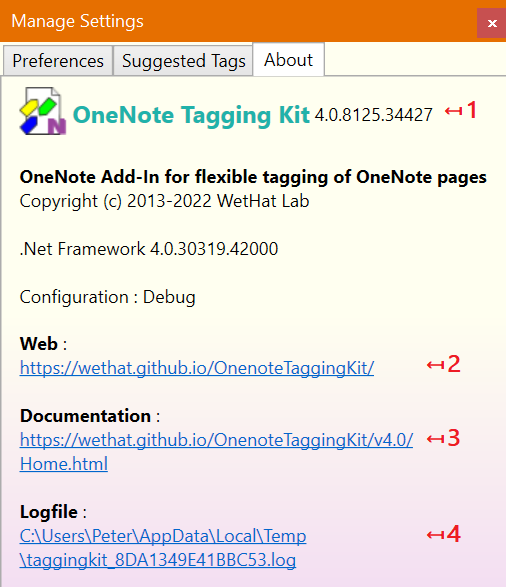

# The _About_ Tab

{.rightfloat}
On the _About: tab support information is shown.

:point_up: Numbered dialog elements are referenced by list item indices.

1. The add-in version.
2. Hyperlink to the home page of the _OneNote Taggink Kit_ add-in.
3. Hyperlink to the user manual of the _OneNote Taggink Kit_ add-in.
4. Location of the add-in log file.
   :point_up: Always attach this log file to bug reports to support bug
   analysis.