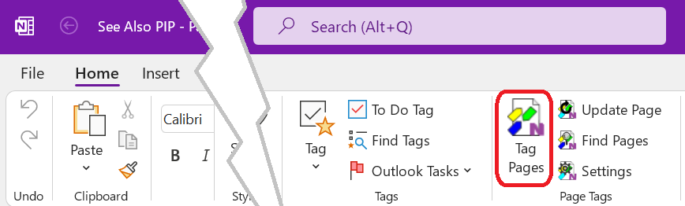
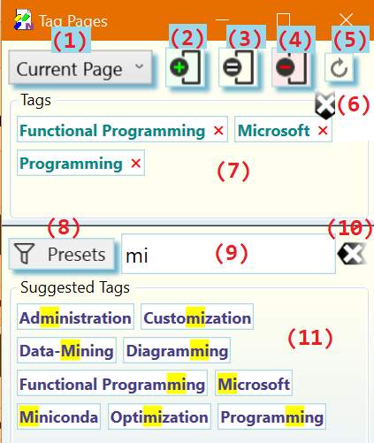

# Apply Tags to _OneNote_ Pages{.title}

The _Tag Pages_ dialog is used to apply _Page Tags_ to one ore more
_OneNote_ pages in various ways.

To acivate the _Tag Pages_ dialog click or tap on the _Tag Pages_
button of the _Page Tags_ group in the `Home` tab of the _OneNote_ ribbon.

# The _Tag Pages_ Dialog

:warning: Numbered dialog elements are referenced by superscripts and list item
indices.

{.rightfloat}

1. The tagging scope selector. Defines the range of pages to apply the tagging
   operation to. Available ranges are _Current Page_ (default),
   _Selected Pages_, and _Current Section_.

   :sparkles: If you have chosen the _Selected Pages_ option you may at this
   point select any number of pages in the current _OneNote_ section.
   **Do not** close the _Tag Pages_ dialog while selecting pages in OneNote.
   To select multiple pages remember to hold the `CTRL` key during selection.
2. Add all tags shown in the _Tags_ panel^8^ to the range of the selected
   range of pages^1^.
3. Set the tags of the range of selected pages^1^ to exactly the tags
    shown in the _Tags_ panel^8^. With the exception of imported tags,
    This **replaces** all _Page Tags_ in the rage of pages.
4. Remove all tags shown in the _Tags_ panel^8^ from the selected range of
   pages^1^.
5. Update all [Saved Searches](../SavedSearch.md) in the selected
   range of pages^1^ page and, if enabled on the
   [Preference](../Settings/Preferences-Tab.md) of the
   [Manage Settings](../Settings/Manage%20Settings.md) dialog, update imported
   _OneNote_ and hashtags.
6. Clear the tags selected for tagging in the _Tags_ panel^8^.
7. A tag selected for a tagging operation. A click or tap on this tag removes
   it from the _Tags_ panel^8^.
8. The _Tags_ panel. Contains all tags selected for a subsequent tagging
   operation^2,3,4^.
9. Tag presets. Filters the collection of tags currently available in the
   _Suggested Tags_ panel^13^. The tag presets are entered into the
   tag input box^10^ as comma separated list and applied as a filter to the
   _Suggested Tags_ panel^13^. The _Add Matching Tags_ action^12^ can then be
   used to add all fully matching tags to the _Tags_ panel^8^ for a subsequent
   tagging operation.
10. Tag input box for entering one or more tags (comma ',' separated).
    Tags in the _Suggested Tags_ panel^13^ are filtered and highlighted as you
    type. Following keyboard shortcuts are supported while focus is on the
    input box:

    `ESC`
    :   Clear the input box. Same as pressing the _Clear_ button^11^.

    `SHIFT`+`ESC`
    :   Clear the input box (Same as pressing the _Clear_ button^11^) **and**
        also deselect all tags in the _Tags_ panel^8^.

    `ENTER`
    :   Add the typed list of tag names to the _Tags_ panel^8^ for use in
        subsequent tagging operations. Tag names are updated according to
        the _Tag Format_ selected on the [Preferences](../Settings/Preferences-Tab.md)
        tab of the [Settings](../Settings/Manage%20Settings.md) dialog, if they
        are new.

    `SHIFT`+`ENTER` or `CTRL`+`+`
    :   Same action as pressing `ENTER` **and** clicking the _Add_ button^2^.

    `CTRL`+`ENTER` or `CTRL`+`-`
    :   Same action as pressing `ENTER` **and** clicking the _Remove_ button^4^.

    `SHIFT`+`CTRL`-`ENTER`
    :   Same action as pressing `ENTER` **and** clicking the _Set_ button^3^.
11. Clears the tag input box^10^ and removes all highlight from the
    _Suggested Tags_ panel^13^.
12. Add all tags which fully match the tag names enterd in the tag input box^10^
    to the _Tags_ panel^8^ for tagging.
13. The _Suggested Tags_ panel containing the collection of tags available for
    tagging.
14. An available tag with a match highlight of the partial tag name entered in the
    tag input box^10^.

# Workflows{.unfloat}

## Applying tags to one or more pages.
> 1. Browse to a _OneNote_ page you intend to tag.
> 2. Specify the tags to apply. The tags to be used in a tagging operation can be
>    selected by:
>    * clicking or tapping on one or more tags in the _Suggested Tags_ panel^13^.
>      Selected tags are added to the _Tags_ panel^8^. To deselect a tag,
>      click or tap on it in the _Tags_ panel^8^.
>
>     :sparkles: If the _Suggested Tags_ panel^13^ contains a large number of tags,
>     you can enter a comma separated list of partial tag names into the tag input
>     box^10^ to filter down the number of tags displayed. The tag suggestions^13^
>     are updated as you type to show matching tags.
>
>   * Typing one or more tag names separated by comma **','** into the tag input
>     box^10^. The tag suggestions^13^ are updated as you type to show currently
>     available, matching tags. Press `ENTER` to add all tags to the _Tags_
>     collection^8^. Typed tag names are updated according to the _Tag Format_
>     selected on the [Preferences](../Settings/Preferences-Tab.md) tab of the
>     [Settings](../Settings/Manage%20Settings.md) dialog.
>
1.
2. On the _OneNote__Home_ tab click on the _Tag Pages_ button in the _Page Tags_
   command group:

3. The _Tag Pages_  dialog opens where you can select and apply tags to
   _OneNote_pages as described below:

4. Select a range of pages to apply the tags to in the scope selector **(1)**.
   If you have chosen the _Selected Pages_ option you may at this point select
   any number of pages in the current _OneNote_ section.
   **Do not** close the _Tag Pages_ dialog while selecting pages in OneNote.
   To select multiple pages remember to hold the **CTRL** key during selection.

5. Define the tags to apply to a one or more pages by:
   * typing one or more tags separated by comma **','** into the tag input box **(9)**.
     The tag suggestions **(11)** are updated as you type to show matching tags.
     Press **ENTER** to add all tags to the _Tags_ list as you typed them, or select the tags
     you want from the _Suggested Tags_ panel **(11)**.

     To clear the tag input box **(9)** and start over, click on the _clear input_ button **(10)**
     or press **ESC**. To clear the tag input box **(9)** **and** the _Tags_ list **(7)**,
     press **SHIFT+ESC**.
   * picking one or more tags from the list of suggested tags **(9)**.

     To remove individual tags from the _Tags_ **(7)** panel click on the
     tag. To remove all tags at once click the _Clear_ button **(6)**
   * selecting a preset filter **(8)** to generate context specific suggestions in **(9)**
     and then picking one or more tags from the (filtered) list of suggested tags **(11)** or pressing
     **ENTER** to chose all tags listed in **(9)**.
6. Apply the tags shown in **(7)** to the selected range of pages by pressing one of the action
   buttons **(2)**, **(3)**, or **(4)**. Following actions are available:
   * **Add Tags (2)**: The tags in the _Tags_ list **(7)** are added to page(s).
     Other Tags already on the selected pages are left intact.

     Alternatively, if keyboard focus is still in the tag input box **(9)**, you can
     press **SHIFT**+**ENTER** or **CTRL**-**+** to add tags to the _Tags_ **(7)**
     list **and** add them to the selected pages.
   * **Set Tags (3)**: The tags in the _Tags_ list **(7)** replace all tags
     in the range of selected pages.

     Alternatively, if keyboard focus is still
     in the tag input box **(9)**, you can
     press **SHIFT**-**CTRL**-**ENTER**  to add tags to the _Tags_ **(9)**
     **and** set them on the selected pages.
   * **Remove Tags (4)**: The tags shown in the _Tags_ list **(7)** are removed from the
     range of pages. Other Tags already on the range of pages which do not appear
     in the list are left intact.

     Alternatively, if keyboard focus is still in the tag input box **(9)**, you can
     press **CTRL**-**ENTER** or **CTRL**-**-** to add tags to the _Tags_
     list **(7)** **and** remove them from the selected pages.

Depending on the tag display options selected in the [[Preferences|Preferences-Tab]] dialog
page tag changes should appear on the affected page like so:

or

**Notes**:

* Tags that were not previously in the suggestion list **(11)**,
  are added automatically when they are applied.

* The tags displayed on the top of each tagged page are meant to be **read-only**. However, OneNote
  does not have any concept of _read-only_, so it is possible to manually edit the
  tags on the page. If manual edits happened the internal tag database of the _OneNote Tagging Kit_
  is _out-of-sync_ with the tags displayed on the page. Press the _re-sync_ button **(5)** to
  resynchronize the tags with the internal database.

  _Re-syncing_ is also useful to update tag display after tag related configuration changes
  with the [[Preferences|Preferences-Tab]] dialog.

