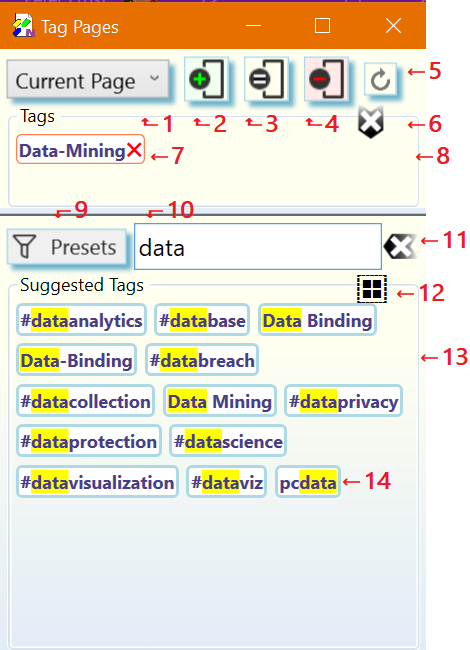

# Managing _Page Tags_ on _OneNote_ Pages{.title}

The _Tag Pages_ dialog is used to apply _Page Tags_ to one ore more
_OneNote_ pages in various ways.

To acivate the _Tag Pages_ dialog click or tap on the _Tag Pages_
button of the _Page Tags_ group in the `Home` tab of the _OneNote_ ribbon.

# The _Tag Pages_ Dialog

:point_up: Numbered dialog elements are referenced by superscripts and list item
indices.

{.rightfloat}

1. The tagging scope selector. Defines the range of pages to apply the tagging
   operation to. Available ranges are _Current Page_ (default),
   _Selected Pages_, and _Current Section_.{id="Dia-1"}

   :point_up: If you have chosen the _Selected Pages_ option you may at
   this point select any number of pages in the current _OneNote_ section.
   **Do not** close the _Tag Pages_ dialog while selecting pages in OneNote.
   To select multiple pages remember to hold the `CTRL` key during selection.
2. Add all tags shown in the _Tags_ panel[^8^](#Dia-8) to the range of the selected
   range of pages[^1^](#Dia-1). This tagging operations is performed in the
   background.{id="Dia-2"}
3. Set the tags of the range of selected pages[^1^](#Dia-1) to exactly the tags
   shown in the _Tags_ panel[^8^](#Dia-8). With the exception of imported tags,
   This **replaces** all _Page Tags_ in the rage of pages.
   This tagging operations is performed in the background.{id="Dia-3"}
4. Remove all tags shown in the _Tags_ panel[^8^](#Dia-8) from the selected range of
   pages[^1^](#Dia-1).This tagging operations is performed in the background.{id="Dia-4"}
5. Updates [Saved Searches](../Search/Advanced/Saved%20Search.md) embedded in the selected
   range of pages[^1^](#Dia-1) and also, if enabled on the
   [Preferences](../Settings/Tabs/Preferences.md) tab of the
   [Manage Settings](../Settings/Manage%20Settings.md) dialog, updates imported
   _OneNote_ and hashtags found in page content.{id="Dia-5"}
   
   :point_up: This action is similar to the [Update](../Update.md) command except that it
   can perform updates on more that one page.
6. Clear the tags selected for tagging in the _Tags_ pane[^8^](#Dia-8).{id="Dia-6"}
7. A tag selected for a tagging operation. A click or tap on this tag removes
   it from the _Tags_ panel[^8^](#Dia-8).{id="Dia-7"}
8. The _Tags_ panel. Contains all tags selected for a subsequent tagging
   operation[^2,3,4^](#Dia-2).{id="Dia-8"}
9. Tag presets. Filters the collection of tags currently available in the
   _Suggested Tags_ panel[^13^](#Dia-13). The tag presets are entered into the
   tag input box[^10^](#Dia-10)as comma separated list and applied as a filter to the
   _Suggested Tags_ panel[^13^](#Dia-13). The _Add Matching Tags_ action[^12^](#Dia-12) can then be
   used to add all fully matching tags to the _Tags_ panel[^8^](#Dia-8) for a subsequent
   tagging operation.{id="Dia-9"}
10. Tag input box for entering one or more tags (comma ',' separated).
    Tags in the _Suggested Tags_ panel[^13^](#Dia-13) are only shown if they match
    one of the typed tag names.{id="Dia-10"}
    
    Following keyboard shortcuts are supported while focus is on the
    input box:

    `ESC`
    :   Clear the input box. Same as pressing the _Clear_ button[^11^](#Dia-11).

    `SHIFT`+`ESC`
    :   Clear the input box (Same as pressing the _Clear_ button[^11^](#Dia-11)) **and**
        also the _Clear_ button[^6^](#Dia-6).

    `ENTER`
    :   Add the typed list of tag names to the _Tags_ panel[^8^](#Dia-8) for use in
        subsequent tagging operations. Tag names are updated according to
        the _Tag Format_ selected on the [Preferences](../Settings/Tabs/Preferences.md)
        tab of the [Settings](../Settings/Manage%20Settings.md) dialog, if they
        are new.

    `SHIFT`+`ENTER` or `CTRL`+`+`
    :   Same action as pressing `ENTER` **and** clicking the _Add_ button[^2^](#Dia-2).

    `CTRL`+`ENTER` or `CTRL`+`-`
    :   Same action as pressing `ENTER` **and** clicking the _Remove_ button[^4^](#Dia-4).

    `SHIFT`+`CTRL`-`ENTER`
    :   Same action as pressing `ENTER` **and** clicking the _Set_ button[^3^](#Dia-3).
11. Clears the tag input box[^10^](#Dia-10) and removes all highlight from the
    _Suggested Tags_ panel[^13^](#Dia-13).{id="Dia-11"}
12. Add all tags which fully match the tag names enterd in the tag input box[^10^](#Dia-10)
    to the _Tags_ panel[^8^](#Dia-8) for tagging.{id="Dia-12"}
13. The _Suggested Tags_ panel containing the collection of tags available for
    tagging.{id="Dia-13"}
14. An available tag with a match highlight of the partial tag name entered in the
    tag input box[[^10^](#Dia-10)(#Dia-10).{id="Dia-14"}

# Workflows{.unfloat}

## Applying Tags to one or more Pages
>
> 1. Browse to a _OneNote_ page you intend to tag.
> 2. Choose the range of pages to apply the tags to[^1^](#Dia-1)
> 3. Specify the tags to apply. The tags to be used in a tagging operation can be
>    selected by:
>    * clicking or tapping on one or more tags in the _Suggested Tags_ panel[^13^](#Dia-13).
>      Selected tags are added to the _Tags_ panel[^8^](#Dia-8). To deselect a tag,
>      click or tap on it in the _Tags_ panel[^8^](#Dia-8).
>
>      :point_up: If the _Suggested Tags_ panel[^13^](#Dia-13) contains a large number of tags,
>      enter a comma separated list of partial tag names into the tag input
>      box[^10^](#Dia-10) to filter down the number of tags displayed. The tag suggestions[^13^](#Dia-13)
>      are updated as you type to show matching tags.
>
>    * typing one or more tag names separated by comma **','** into the tag input
>      box[^10^](#Dia-10). Press `ENTER` to add all tags to the _Tags_
>      collection[^8^](#Dia-8) or use another keyboard shortcut supported by tag input
>      box[^10^](#Dia-10).
> 4. Choose the one of the tagging operations[2,3,4](#Dia-2). All tagging operations
>    are performed in the background.
> 5. When the requested tagging operation is complete, the result is shown on the
>    affected range of pages according to the tag display options selected on the
>    [Preferences](../Settings/Tabs/Preferences.md) tab of the
>    [Settings](../Settings/Manage%20Settings.md) dialog:
>    
>    **Below Page Title**
>
>    
>
>    :warning: The tags displayed on the top of each tagged page are meant to be
>    **read-only**. However, _OneNote_ does not have any concept of _read-only_,
>    so it is possible to manually edit the tags displayed on the page. If manual
>    edits happened the internal tag database of the _OneNote Tagging Kit_
>    is _out-of-sync_ with the tags displayed on the page.
>    Press the _Update_ button[^5^](#Dia-5) to resynchronize the tags with the
>    internal database.
>    
>    **In Page Title**
>
>    
>
>    :point_up: If any of the tag import options is checked on the
>    [Preferences](../Settings/Tabs/Preferences.md) of the
>    [Settings](../Settings/Manage%20Settings.md) dialog, imported
>    _OneNote_ tags or hashtags from page content will show up as well.
>

## Updating imported Tags and _Saved Searches_

> 1. Browse to a _OneNote_ page you intend to update.
> 2. Choose the range of pages to update[^1^](#Dia-1).
> 3. Start page updates by clicking on the _Update_ button[^5^](#Dia-5). Page
>    updates are performed in the background.
>   
>    :warning: Pages containing [Saved Searches](../Search/Advanced/Saved%20Search.md)
>    can take a long time to update.
>
> For more information about the purpose effect of page updates see
> the [Update](../Update.md) command.
>
> :point_up: Updating pages is also useful to update tag display after changing
> tag related options on the [Preferences](../Settings/Tabs/Preferences.md) of the
> [Settings](../Settings/Manage%20Settings.md) dialog.
