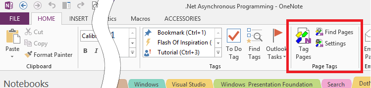

# _Onenote Tagging Kit_ Documentation{.title}

The _OneNoteTaggingKit_ is a free to-use add-in to add page tagging to
OneNote for the desktop.

# Feature Summary

## Page Tags
>
> * _Page Tags_ can be added/removed from one or more pages on-the-fly.
> * Built-in _OneNote_ paragraph tags and hashtags contained in page content
>   can be _imported_ as _Page Tags_ and can participate in
>   [Faceted Search](https://en.wikipedia.org/wiki/Faceted_search)
> * Page tags are automatically shared to all connected _OneNote_ clients and
>   are fully functional if the add-in is installed.
> * _Page Tags_ are available to the built-in _OneNote_ paragraph tagging
>   system, even if the _Tagging Kit_ add-in is not installed.

## Tag Management
>
> * _Tagging Kit_ dialogs to apply and manage _Page Tags_ are integrated
>    with the _OneNote_ user interface.
> * Tagging operations run in the background. The user can continue to interact
>   with _OneNote_ while tagging is in progress.

## Faceted Search
>
> * A dialog to find pages by
>   [Faceted Search](https://en.wikipedia.org/wiki/Faceted_search) is
>   integrated with the _OneNote_ user interface
> * Search result can be saved to a _OneNote_ page and updated on request.
> * The search dialog can be used to automatically provide information related
>   to the _OneNote_ page currently being viewed. 

# System Requirements

* _OneNote_ 2010, 2013, 2016, 2019 or later, _OneNote_ 365 Desktop (from Office 365).
  :warning: The Windows App Store version is **not** supported.
* Windows 7, 8, 8.1, 10 (32-bit/64-bit); Windows Server 2008 R2 or later
* .net 4.5

To instructions on how to check the _OneNote_ version refer
to [OneNote Version Check](OneNote-Version-Check.md)

# Installation and Upgrade

The add-in can be installed or upgraded in one of the following ways:

## Direct Installation / Upgrade
>
> 1. Verify that the system requirements are met.
> 2. Download the installer (`*.msi`) from [Releases](https://github.com/WetHat/OnenoteTaggingKit/releases).
> 3. Make sure _OneNote_ is **not running**! Exit _OneNote_ if necessary.
> 4. For first time installation and upgrade execute the downloaded installer (`*.msi`)
> 5. Start OneNote.

## Installation / Upgrade via the [Chocolatey Package Manager](https://community.chocolatey.org/packages/onenote-taggingkit-addin.install)
> [Chocolatey](https://chocolatey.org/) can be [installed here](https://chocolatey.org/install).
> If you are wondering why you would want to use Chocolatey,
> [here is why](https://chocolatey.org/why-chocolatey)
>
> 1. Verify that you have a supported version of OneNote.
>   See [OneNote Version Check](OneNote-Version-Check.md) on how to do that.
> 2. Make sure _OneNote_ is **not running**! Exit _OneNote_ if necessary.
> 3. Open a new PowerShell command prompt with **admin privileges**.
> 4. Excecute one of the following commands
>
>    **First Time Install**
>    ~~~ powershell
>    PS C:\> choco install onenote-taggingkit-addin.install
>    ~~~
>
>    **Upgrade**
>    ~~~ powershell
>    PS C:\> choco upgrade onenote-taggingkit-addin.install
>    ~~~

Upon successfull installation the _OneNote Tagging Kit_ actions should now be
available on the `Home` tab in
the _Page Tags_ command group (next to the built-in Tags command group)

If you do not see this ribbon extension please refer to
[Tagging Kit Actions Not Shown in Ribbon](Support/Tagging%20Kit%20Not%20Shown%20in%20Ribbon.md)

# _OneNote Tagging Kit_ User Manual

* [The Ribbon Bar](Usage/Ribbon.md) - Accessing the integrated _Tagging Kit_
  commands and dialogs.
* [Tagging Pages](Usage/Tagging%20Pages/Tagging%20Pages.md) - Applying
  _Page Tags_ to _OneNote_ pages.
* [Updating Pages](Usage/Update.md) - Importing tags from _OneNote_ page content and
  updating _Saved Searches_-
* [Finding Pages](Usage/Search/Finding%20Notes.md) - Finding pages by tags and
  full-text queries.
* [Add-In Settings](Usage/Settings/Manage%20Settings.md) - Customizing the
  _Tagging Kit_.

# _Tagging Kit_ Development

The developer documentation can be found at [here](https://github.com/WetHat/OnenoteTaggingKit/blob/master/TaggingKitSandcastle/Documentation/Home.md).

Following tools are required to develop your own version of the _TaggingKit_:

* VisualStudio 2019 or later. See [Install Visual Studio](https://docs.microsoft.com/en-us/visualstudio/install/install-visual-studio)
* Windows Installer Toolset [WiX](http://wixtoolset.org/).
  Get the [recommended build](http://wixtoolset.org/releases/)
* Sandcastle Help File Builder (SHFB) for building help files with the Sandcastle tools.
  Get the latest release for GitHub [EWSoftware/SHFB ](https://github.com/EWSoftware/SHFB/releases)
* If you want to manage your clone of the _TaggingKit_ on GitHub it is also recommended to use the _Git_ distributed version control system: Get it from the
  the [Git - Downloads](https://git-scm.com/downloads) page.
