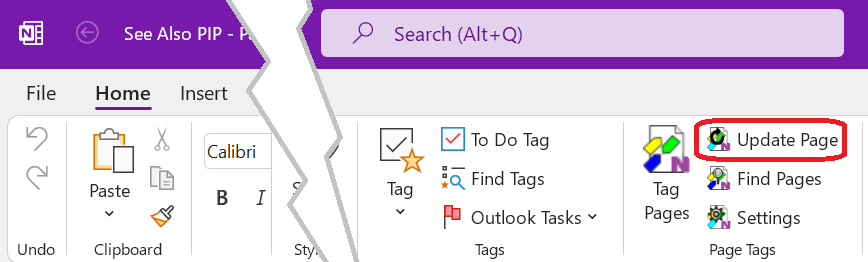

# Update Current Page{.title}

A command on the import tags from the page content and update embedded _Saved Search_
content on the page.

To update the current page, tap or click the _Update Page_ button in the  _Page Tags_ group
of the `Home` tab of the _OneNote_ ribbon. To update a range of pages use the
[Update](Tagging%20Pages/Tagging%20Pages.md#Dia-5) action on the
[Tag Pages](Tagging%20Pages/Tagging%20Pages.md) dialog.

See [Saved Search](Search/Advanced/Saved%20Search.md) about saving search results to a
OneNote page and keeping it up-to-date.