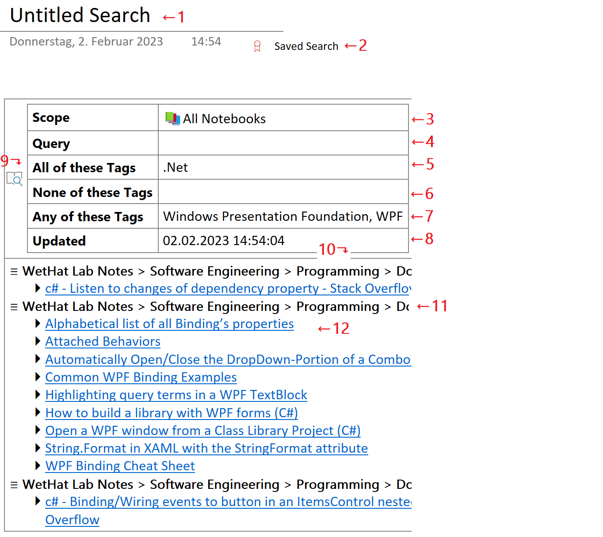

# Saving Search Results to a _OneNote_ Page{.title}

Search results obtained by the [_Find Pages_](../Finding%20Notes.md) dialog can
be saved as _semi-active_ content to a new _OneNote_ page in the current section
using the `Save Search Result` action from the
[drop-down menu](../Finding%20Notes.md#Dia-14)
of the [_Pages_](../Finding%20Notes.md#Dia-15) search result panel.

:point_up: The _Saved Search_ is stored as a table. The full-text search query cell
and the tag list cells can be manually edited to
adjust the search result. Changes will take effect
on next page update by the [_Update_](../../Update.md) command or the
[_Update_](../../Tagging%20Pages/Tagging%20Pages.md#Dia-5) action of the
[_Tag Pages_](../../Tagging%20Pages/Tagging%20Pages.md) dialog.

:point_up: The tag names are matched in a lenient way by
ignoring hash characters, casing, or spacing. E.g
the tags `#softwaredevelopment`, `#SoftwareDevelopment`, `SoftwareDevelopment`,
`Software Development` are all treated as equivalent.

{.rightfloat}

#  _Saved Search_ Page Layout{id="Layout"}

:point_up: Numbered cells of the sample _Saved Search_ are referenced by superscripts and list item
indices.

1. The default title of a _Saved Search_. Can be changed by the user.

2. By default pages containing _Saved Searches_ are marked with the _Saved Search_
   tag. This makes it easy to locate these pages later with the
   [_Find pages_](../Finding%20Notes.md) dialog.
   This tag can be removed with the
   [Tag Pages](../../Tagging%20Pages/Tagging%20Pages.md#Dia-14)) dialog,
   however that is not recommended.

3. The [search scope](../Finding%20Notes.md#Dia-1) that was in effect
   when the search result was saved by the
   [`Save Search Result`](../Finding%20Notes.md##Dia-14) action in the
   [_Find pages_](../Finding%20Notes.md) dialog.

   :stop_sign: **This cell is meant to be read-only.**
   Any edits may cause unpredictable side effects!

4. The [full-text query](../Finding%20Notes.md#Dia-2) that was in effect when
   the search result was saved by the
   [`Save Search Result`](../Finding%20Notes.md##Dia-14) action in the
   [_Find pages_](../Finding%20Notes.md) dialog.

   :point_up: **This cell can be edited.**

5. The comma-separated list of [refinement tags](../Finding%20Notes.md#Dia-5)
   that were in effect for the [_All of .._](../Finding%20Notes.md#Dia-4) filter
   when the search result was saved by the
   [`Save Search Result`](../Finding%20Notes.md#Dia-14)
   action in the [_Find pages_](../Finding%20Notes.md#Dia-2) dialog.

6. The comma-separated list of [refinement tags](../Finding%20Notes.md#Dia-5)
   that were in effect for the [_None of .._](../Finding%20Notes.md#Dia-4) filter
   when the search
   result was saved by the [`Save Search Result`](../Finding%20Notes.md#Dia-14)
   action in the [_Find pages_](../Finding%20Notes.md#Dia-2) dialog.

7. The comma-separated list of [refinement tags](../Finding%20Notes.md#Dia-5)
   that were in effect for the [_Any of .._](../Finding%20Notes.md#Dia-4) filter
   when the search
   result was saved by the [`Save Search Result`](../Finding%20Notes.md#Dia-14)
   action in the [_Find pages_](../Finding%20Notes.md#Dia-2) dialog.

8. The timestamp when the _Saved Search_ was created or last updated
   by the [_Update_](../../Update.md) command or the
   [_Update_](../../Tagging%20Pages/Tagging%20Pages.md#Dia-5) action of the
   [_Tag Pages_](../../Tagging%20Pages/Tagging%20Pages.md) dialog.

   :stop_sign: **This cell is meant to be read-only.**
   Any edits will be lost!

9. A _OneNote_ paragraph tag marking the search configuration that was captured
   when the search result was saved by the `Save Search Result` action
   of  the [_Pages_](../Finding%20Notes.md#Dia-14) search result panel.

   :stop_sign: **If this _OneNote_ tag is removed or changed the saved search
   can no longer be updated.**

10. List of pages constituting the search result grouped by location.

    :stop_sign: **This cell is is meant to be read-only.** Any changes will
    be lost on next update.

11. The path to the page in the _OneNote_ page hierarchy.

12. A hyperlink of a page in the search result. Navigates to the page when clicked.

