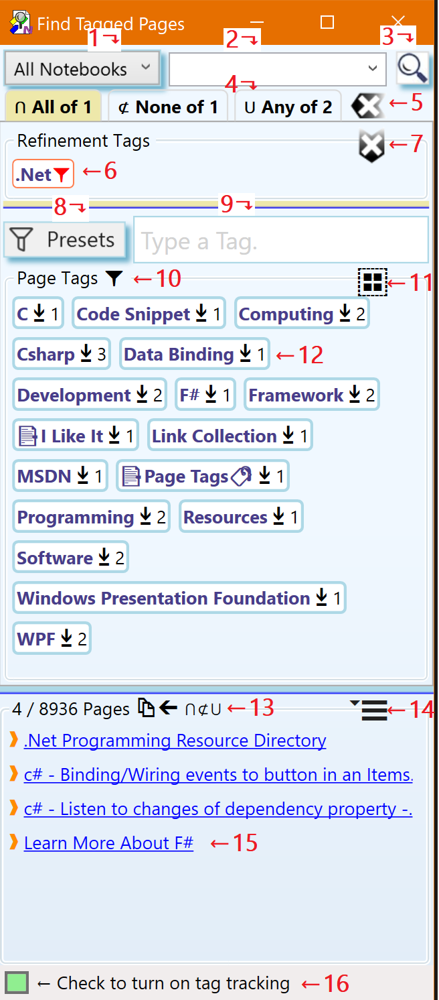
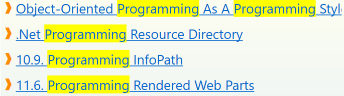

# Finding _OneNote_ Pages

The _Find Pages_ dialog is used to find _OneNote_ pages by applying tag and
full text filters.

To activate the _Find Pages_ dialog click or tap on the _Find Pages_
button of the _Page Tags_ button group in the `Home` tab of the _OneNote_ ribbon.

# The _Find Pages_ Dialog

:point_up: Numbered dialog elements in the screenshot are referenced by
superscripts and list item indices of the documentation below.

{.rightfloat width="40%"}

1. The search scope. Only pages in the selected scope will be included in the
   search result. Available scopes are:{id="Dia-1"}

   `This Section`
   :   Only pages from the current section are included in the search result.

   `This Section Group`
   :    Only pages from the current section group are included in the
        search result.

   `This Notebook`
   :   Only pages from the current notebook are included in the
        search result.

   `All Notebooks`
   :   Pages from all notebooks currently open in OneNote are included in the
       search result.

2. Search query input box for full text search. Following key bindings are
   available while focus is on the query input box:{id="Dia-2"}

    `ESC`
    :   Clear the query input box. To update the query tap or click the search
        button[^3^](#Dia-3).

    `ENTER`
    :   Perform a full text search using the entered search terms.
       Same as clicking on the _search_ button[^3^](#Dia-3)

3. Perform a full text search using the terms in the query input
   box[^2^] and the selected scope [^1^](#Dia-1).{id="Dia-3"}

   The search result is passed through the tag filters [^4^](#Dia-4)
   and the final result is displayed in the _Pages_ panel[^13^](#Dia-13).
   
   Matches of search terms with page titles are highlighted
   in the _Pages_ panel [^13^](#Dia-13):
   
   {width="50%"}
   
4. Filter Configuration panels. Three filter strategies are available:{id="Dia-4"}
    
   * **⋂ All of #** - Pages must have all of the selected tags in order to pass the filer.
   * **⊄ None of #** - For pages to pass this filter none of the selected tags can be on them.
   * **⋃ Any of #** - Pages with any of the selected tags pass this filter.
   
   :point_up: The numbers `#` in tab labels indicate the number of filter tags selected
   for this filter.
   
   To add or remove tags for a particular filter click or tap on its label to activate it
   for editing. The label of the active filter is highlighted. In the dialog
   screenshot the _All of_ filter is activated and tags can added or removed.
   
   All filters applied to the search result. If a filter does not have any filter tags
   selected it simply passes all pages through to the next filter:
   
   ~~~bob
    Pages                                                Result
     ┌───┐                                                ┌───┐
   ┌─| ─ |     ┌───────┐     ┌────────┐     ┌───────┐     | ─ |
   | | ─ | ──> | ⋂ All | ──> | ⊄ None | ──> | ⋃ Any | ──> | ─ |
   | └─┬─┘     └───────┘     └────────┘     └───────┘     └───┘
   └───┘
   ~~~ 
   
5. Clear all selected tags in all filter strategies.{id="Dia-5"}
    
   This is a convienent way to reset **all** filters with one tap or click.
   This button is only visible if the are filter tags selected in any but the
   currently active filter. To clear the selected tags from the currently active
   filter use this button [^7^](#Dia-7)
    
6. A tag selected for filtering according to the currently selected filter
   strategy.{id="Dia-6"}
   
   The tag can be removed from the filter by tapping or clicking it.

7. Removes all currently selected tags from the active filter.{id="Dia-7"}
    
   To remove all filter tags, including the ones from the filters which are not
   active, use this button[^5^](#Dia-5)

8. Tag Filter Presets.{id="Dia-8"}
    
   Highlights the collection of tags currently available in the
   _Page Tags_ panel[^10^](#Dia-10) based on tags found in the selected range of pages.
   The tag presets are entered into the tag input box[^9^](#Dia-9)
   as comma separated list and can be used to select tags for the currently
   active filter.
   
   To select all tags for filtering which exactly match one of the tags from
   the preset, tap or click the _Select all matching tags_ button
   [^11^](#Dia-11).

9. Tag input box.{id="Dia-9"}
   
   Enter one or more tagnames (comma ',' separated) to
   to show only tags in the _Page Tags_ panel[^10^](#Dia-10) which partially or fully
   match any of the typed tag names.
   The collection of tags in the _Page Tags_ panel[^10^](#Dia-10) is updated
   as you type.

   Following keyboard shortcuts are supported while focus is on the
   input box:

   `ESC`
   :   Clear the input box. Same as pressing the _Clear_ button which appears
       next to the input box [^9^](#Dia-9) once tags are typed.

   `SHIFT`+`ESC`
   :   Clear the tag input box and also clear all currently selected refinement
       tags[^5^](#Dia-5) (Same as pressing the _Clear_ button[^9^](#Dia-9)) **and**
       also the _Clear_ button[^6^](#Dia-6).

   `ENTER`
   :   Select all tags from the collection of tags in the _Page Tags_ panel[^10^](#Dia-10)
       which fully match one of the entered tag names to happen to fully match a tag.
       The collection of refinement tags in the _Refinement Tags_ panel[^5^](#Dia-5)
       and the list of found pages[^14^](#Dia-14) are updated accordingly.

10. _Page Tags_ panel.{id="Dia-10"}
    
    This panel shows the collection of tags available for filtering. 
    
    Following status information is privided in the panel header:

    **(`number`)** - The total number of tags available for filtering. This is icon
    only shown if no tag has been selected for filtering[^6^](#Dia-6) **and**
    no tag search expression has been entered in the tag input field[^9^](#Dia-9).
    
    {height="16" align="bottom"}
    Shown when one or more tags are selected for the currently active filter.
    
    As soon as a tag is selected for filtering (selected tags are displayed in the
    _Refinement Tags_ panel [^6^](#Dia-6)) the collection of tags available for
    selection is reduced to show only tags which would _improve_ the search result.
    Tags are removed if:
    
    * They would reduce the search result to nothing.
    * They would not reduce the search result any further.
    
    {height="16" align="bottom"}
    This icon is present if a tag search expression has been entered
    in the tag input field[^9^](#Dia-9). Only tags which partially or fully
    match the search expression in [^9^](#Dia-9) are shown.
    
    :point_up: If the collection of tags is inconveniently large,
    enter a tag filter into the tag filter input box [^9^](#Dia-9) to show only matching tags.

11. Select fully matching tags.{id="Dia-11"}
    Selects all tags from the _Page Tags_[^10^](#Dia-10)
    panel which fully match one of the tag names entered in the tag filter input
    box[^9^](#Dia-9).
    
    This action does nothing if there are no tags whose names fully match the
    filter expression in the input box[^9^](#Dia-9). 

12. A tag available for search result refinement.{id="Dia-12"}
    
    On tap or click the tag will be selected for the filter an moves to the
    active _Refinement Tags_[^4^](#Dia-4) panel.
    
    Tags can have following _type_ indicators which prefix the tag name:
    
    **#** - A hashtag. See the [Preferences](../Settings/Tabs/Preferences.md)
    tab of the _Manage Settings_ for tag formats.
    
     **⏹** - A hashtag imported from page content. See the [Preferences](../Settings/Tabs/Preferences.md)
     tab of the _Manage Settings_ dialog for import options.
     
     **📑** - An imported OneNote paragraph tag. See the [Preferences](../Settings/Tabs/Preferences.md)
     tab of the _Manage Settings_ dialog for import options. The _Page Tags_
     panel [^10^](#Dia-10) shows two imported paragraph tags _I Like It_ and
     _Page Tags_
     
     Each tag is annotated with a postfix number which predicts the number of
     pages in the search result if this tag would be added to the filter.

13. The _Pages_ search result panel.{id="Dia-14"},
    
    Displays links to all pages matching
    the refinement tag filter[^5^](#Dia-5) and the full text query specified
    in [^2^](#Dia-2) (if available).
     
    The Panel header shows additional status information:{id="Dia-13"}

    **number / number** - Number of pages in the filtered search result / Total number of pages 
      pages matching the search criteria.
    
    **⋂** - The set intersection symbol. Indicates that pages were filtered#
    by the _All of_ filter[^4^](#Dia-4) and contain all tags selected for
    this filter.
    
    **⊄** - The _not a subset of_ symbol. Indicates that pages were filtered
    by the _None of_ exclusion filter[^4^](#Dia-4) and none of the pages in the
    result contain any tags selected for this filter.
    
    **⋃** - The set union symbol. Indicates that pages were filtered
    by the _Any of_ filter and the pages contain one or more of the tags
    selected for this filter
    
    **🔍** - A full text search query[^2^](#Dia-2) was performed to obtain the
    pages.

14. The _Search Result Action Menu_. Click or tap to access actions for the
    search result[^14^](#Dia-14).{id="Dia-14"}

    The available actions are.

    `Refresh`
    :   Refresh the search result using the current collection of filter
        tags[^4^](#Dia-4) and the current search query. This is sometimes
        needed when pages have been tagged while _Find Pages_ dialog was open or
        the OneNote notebook was updated after a concurrent edit by someone else.

    `Clear Selection`
    :   Deselect all page links[^15^](#Dia-15) in the _Pages_ search result
        panel[^13^](#Dia-13).

    `Select All`
    :   Select all page links in the in the _Pages_ search result
        panel[^13^](#Dia-13).

    `Copy Links to Pages`
    :   Copy all hyperlinks all _Pages_ search result
        panel[^13^](#Dia-13) to the system clipboard. These links can be pasted
        into all HTML capable applications such as _Microsoft Office_.
        
        :point_up: Links to pages in the _OneNote_ recycle bin will be
        automatically removed.

    `Save Search Result`
    :   Saves all links from the _Pages_ search result panel[^13^](#Dia-13)
        together with all search parameters
        (query[^2^](#Dia-2) and refinement tags[^4^](#Dia-4)) to a new
        _OneNote_ page in the current section.
        See [Saved Search](Advanced/Saved%20Search.md) for instruction on how
        to update the search result with the
        [Update](../Update.md) action on the _OneNote_ `Home` ribbon or the
        _Update_action on
        [Tag Pages](../Tagging%20Pages/Tagging%20Pages.md#Dia-5) dialog.

     `Tag Selected Pages`
     :   Opens the [Tag Pages](../Tagging%20Pages/Tagging%20Pages.md) dialog
         to apply tags to all pages selected in the _Pages_ search result
         panel[^13^](#Dia-13).

     `Mark Selected Pages`
     :   Adds a :star: marker tag to all selected pages. This marker tag can
         be managed like a regular _Page Tag_ and also can participate
         in tag based searches. Typically this marker is used for bookmarking.

15. A link to a page in the search result. Tap or click on the link to navigate
    to the page in _OneNote_.{id="Dia-15"}
        
    Links can be selected by clicking on the `❱` symbol. Link selections are
    required for some actions in the _Search Result Action Menu_[^14^](#Dia-14).
    
    Following selection methods are available:
    
    Multi-selection of different links.
    :   `CTRL`+`LeftClick` on the ❱ symbol of each tag. 
    
    Range Selection
    :   1. `CTRL`+`LeftClick` on the ❱ symbol of the first link of the range.
        2. `SHIFT`+`LeftClick` on the ❱ symbol of the last link in the range.
    
    Multi-selection of several disjoint ranges
    :   1. `CTRL`+`LeftClick` on the ❱ symbol of the first link of the range.
        2. `SHIFT`+`CTRL`+`LeftClick` on the ❱ symbol of the range.
        3. Repeat 1 and 2 for other ranges
    
16. Activate Tracking Mode. Automatically tracks related pages based on the tags
    of the current page. When tag tracking is enabled:{id="Dia-17"}

    * the current page's title is displayed next to the tag tracking checkbox.
    * the tags on the current _OneNote_ page are extracted and pre-set as
      filter for the _Page Tags_ panel[^10^](#Dia-10)  Only tags which fully or
      partially match one of the tags in the tag input panel [^8^][#Dia-8] will
      now be shown.
    * The _Select fully matching tags_[^11^](#Dia-11) action  to
      quickly get all pages with these tags.

# Workflows

In the following section typical search workflows are
explained step-by-step.

## Finding Pages by applying Filter Conditions
> The steps below are all optional and can be performed in any order:
> * Select a range where to look for pages in[^1^](#Dia-1).
> * Type one or more search terms into the search input box[^2^](#Dia-2)
>   and either press `ENTER`, or press the search button[^3^](#Dia-3).
> * Add tags from the _Page Tags_ panel[^10^](#Dia-10) to one the three filters.
>   This can be done in the following ways:
>   * by tapping or clicking on the tags in the _Page Tags_ panel[^10^](#Dia-10).
>   * by entering one or more full or partial tag names (comma-separated)
>     into the tag input panel[^8^](#Dia-8). To select the desired tags
>     press `ENTER` or hit the _Add_ button[^11^](#Dia-11).
>     This adds all tags from the _Page Tags_
>     panel[^10^](#Dia-10) which fully match one of
>     the entered tag names to the currently active filter[^4^](#Dia-4).
>     Alternatively you can tap or click on individual tags in the
>     _Page Tags_ panel[^10^](#Dia-10).
>   * by selecting a preset[^8^](#Dia-8) to enter the tags found on a
>     range of pages into the tag input box[^9^](#Dia-9) and then
>     hitting the _Add_ button[^11^](#Dia-11) to add all tags from the _Page Tags_
>     panel[^10^](#Dia-10) which fully match one of
>     the entered tag names.
>
> :point-up: After any of the steps above the search result[^13^](#Dia-13) is
> updated. 

## Handling large Numbers of Tags
>
> Eventually, as the used tags increases the _Page Tags_ panel[^10^](#Dia-10)
> will become crowded. This makes tag selection increasingly difficult because
> there will be a lot of scrolling required to get to the desired tags. 
> To reduce the number of tags shown in
> the Page Tags_ panel[^10^](#Dia-10) type a comma-separated list of tag names
> into the tag input box[^9^](#Dia-9).
> This will the show only tags which partiall or fully match one of the typed tags.
> Instead of typing tags you may want use a preset[^8^](#Dia-8) to enter tags
> from a range of pages into the tag input box[^9^](#Dia-9)
>
> At any time, you can start filtering by adding or removing tags to the
> currently active filter.

## Refining a full-text Search Query using tags
>
> We start with a full-text search query which we then refine by a adding
> tag filters.
>
> 1. Pick a scope [^1^](#Dia-1) to define the range of pages.
> 2. Enter one or more search terms[^2^](#Dia-2).
> 3. Tap or click the search button [^3^](#Dia-3) or press `ENTER`
>    while focus is still in the search input box[^2^](#Dia-2)
>    to execute the search.
>    Once the search is completed, a list of pages matching the search term(s)
>    is displayed in the _Pages_ search result panel[^13^](#Dia-13).
>    Search terms which partially or fully match page titles are highlighted[^3^](#Dia-3).
> 4. To narrow down (refine) the search result, select one ore more tags in the
>    _Page Tags_ panel[^10^](#Dia-10) for filtering.
> 5  Only pages which match **all** filter conditions
     also match the full-text search query, if present, are
>    shown in the _Pages_ search result panel[^13^](#Dia-13).
> 6. Click the hyperlinks in the _Pages_ panel[^13^](#Dia-13) to navigate
>    to the corresponding _OneNote_ pages.