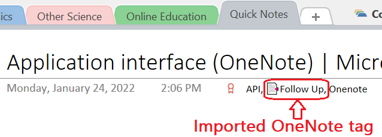

# The _Preferences_ Tab{.title}

{.rightfloat}

:point_up: Numbered dialog elements are referenced list item indices.

1. In the _Dialog Preferences_ section you can disable or enable
   the _always on top_ behavior of the:
   * [Tag Pages](../../Tagging%20Pages/Tagging%20Pages.md)
   * [Find Tagged Pages](../../Search/Finding%20Notes.md) dialog.

2. In the _Operating System Integration_ section you can:
   * Choose the display language of the add-in. By default the language is
     `System` which is the language of the Operating System. You can override
     this by selecting one of the other supported languanges.
      
   * enable/disable the _Windows Search Service_ for searching page tags.
     By default this option is **on** because this the fastest way of finding tags.

     When this option is unchecked a slower, alternative approach for
     finding page tags is used. Unchecking this option may be necessary on systems
     where the _OneNote_/ _Windows Search Service_ integration is broken or turned off.
     
     :warning: Without the Windows Search Service the add-in cannot perform full-text searches!

3. In _Tag Options_ section you can configure format and display
   of page tags on a _OneNote_ page.

   :point_up: Tag formatting is applied to new tags only. Pre-existing tags remain
   unchanged.

   **The available tag format options are:**

   `Capitalized`
   :   The first character of each tag is changed to uppercase. If a
       tag has multiple words separated by space, the first character of each word is
       changed to uppercase.

       Examples:

       * Tag input `documentation` is changed to `Documentation`.
       * Tag input `project documentation` is changed to `Project Documentation`.
   
   `Hashtag`
   :   Tags are formatted as [hashtags](https://en.wikipedia.org/wiki/Hashtag)
       by adding the number sign or pound sign `#` (also known as the hash character)
       at the beginning of each tag name.

       For example tag input `Documentation` is changed to `#documentation`

   `As Entered`
   :   The tag entered by the user is used _as typed_. No formatting is applied.
       Multi-word tags can be separated by spaces.

   **The available tag display options are:**

   `Below Page Title`
   :   Tags are displayed below the title of a _OneNote_ page:

       

       :warning: The tags are represented as editable text, but edits do **not**
        change the actual _Page Tags_. To change page tags the
        [Tag Pages](../../Tagging%20Pages/Tagging%20Pages.md) dialog must be used.
        If the tags were inadvertently edited, the displayed tags can be
        re-synchronized with the internal tag database by  executing the
        [Update](../../Update.md) command or using the
        [Update](../../Tagging%20Pages/Tagging%20Pages.md#Dia-5) action of the
        [Tag Pages](../../Tagging%20Pages/Tagging%20Pages.md) dialog.

   `Icon in Page Title`
   :   A single _OneNote_ tag is added to the page title:

       

       To see the page tags just hover the mouse over the tag icon.

       This option has been introduced to address negative side effects in
       the _OneNote_ Windows Store version which would display the page tags in
       its summary view instead of a page summary:

       
4. Configure the import of tags, which are embedded in
   page content. Imported tags can be utilized by the
   [Find Tagged Pages](../../Search/Finding%20Notes.md) dialog for faceted search.
   However, if the original tags are are changed in the page content, the tags
   require re-import by either executing the [Update](../../Update.md) command or using
   the [Update](../../Tagging%20Pages/Tagging%20Pages.md#Dia-5) action of the
   [Tag Pages](../../Tagging%20Pages/Tagging%20Pages.md) dialog.

   :point_up: Changes to these options do not take effect on existing _OneNote_
   pages until they are tagged again or updated by either executing the
   [Update](../..//Update.md) command or using the
   [Update](../../Tagging%20Pages/Tagging%20Pages.md#Dia-5) action of the
   [Tag Pages](../../Tagging%20Pages/Tagging%20Pages.md) dialog.

   `Map OneNote Tags to Page Tags`
   :   With every tagging operation the page content is scanned for _OneNote_
       paragraph tags. Each _OneNote_ tag found mapped to a corresponding
       _Import Page Tag_. Imported _Page Tags_
       have a special marker prefix, so that they can be distinguished
       from genuine page tags:

       

   `Map Hashtags in Page Text to Page Tags`
   :    With every tagging operation the page content is scanned for
       [hashtags](https://en.wikipedia.org/wiki/Hashtag) embedded in the page text.
       Each hashtag is mapped to a corresponding _Import Page Tag_.
       _Page Tags_ originating from hashtags have a special marker prefix,
       so that they can be distinguished from genuine _Page Tags_:

      
